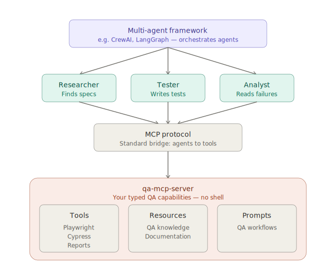

# QA MCP Server

> **Don't give an AI a terminal. Give it QA capabilities.**

`qa-mcp-server` is an open-source Model Context Protocol (MCP) server that gives AI assistants safe, structured access to Quality Engineering work.

It starts with low-level, safe capabilities — running Playwright and Cypress, reading test reports, plus testing guidelines and reusable QA prompts. But Playwright and Cypress are execution details, not the center of the product. The first-class inputs of Quality Engineering are Jira tickets, merge requests, incidents, acceptance criteria, test strategy and business rules.

The long-term objective is to support real QA workflows built on those capabilities — not to replace QA engineers, but to model and augment their work.

> **The long-term objective is not to expose testing tools. It is to expose Quality Engineering capabilities that mirror the real work of QA engineers.**

Instead of exposing a generic terminal, the server exposes purpose-built, typed QA capabilities:

> Help AI agents become better Quality Engineers without giving them unrestricted access to your machine.

---

## Contents

* [Why this project exists](#why-this-project-exists)
* [Current MVP](#current-mvp)
* [Getting Started](#getting-started)
* [Connect it to your project](#connect-it-to-your-project)
* [Real execution (opt-in)](#real-execution-opt-in)
* [Architecture](#architecture)
* [Why not a Terminal?](#why-not-a-terminal)
* [Core Design Principles](#core-design-principles)
* [Roadmap](#roadmap)
* [Vision](#vision)
* [Contributing](#contributing)
* [Documentation](#documentation)
* [License](#license)

---

# Why this project exists

AI assistants are becoming increasingly capable of helping software teams.

They can generate code.

They can review pull requests.

They can explain failures.

The next logical step is helping engineers with software quality.

Unfortunately, most AI integrations achieve this by exposing a generic terminal.

While powerful, a terminal gives an AI access to far more than it actually needs.

Quality Engineering doesn't require unlimited power.

It requires well-designed capabilities.

This project follows a different philosophy.

Instead of exposing a shell, it exposes QA-specific tools that are:

* typed
* predictable
* auditable
* intentionally limited
* safe by default

The goal is not to let an AI do everything.

The goal is to let it do the right things.

---

# Current MVP

The MVP is intentionally small: low-level, safe testing capabilities. Higher-level
QA workflows such as `validate_ticket`, `review_merge_request` and
`investigate_incident` are **long-term targets, not current features** — they will
be built on top of smaller capabilities. See [Vision](#vision) and the
[roadmap](ROADMAP.md).

## Tools

| Tool                | Purpose                        | Status                                          |
| ------------------- | ------------------------------ | ----------------------------------------------- |
| run_playwright_test | Prepare a Playwright test run  | **Dry-run** — returns the command, does not run it |
| run_cypress_test    | Prepare a Cypress test run     | **Dry-run** — returns the command, does not run it |
| read_test_report    | Read a test report file safely | Active — reads from disk, size-capped           |

> **Dry-run by design.** By default the run tools return the exact command they
> *would* execute, without executing anything, so the server is safe to connect
> anywhere. Real execution is available as an explicit opt-in — see
> [Real execution](#real-execution-opt-in).

---

## Resources

| Resource                   | Purpose                   |
| -------------------------- | ------------------------- |
| qa://test-strategy         | Testing strategy          |
| qa://playwright-guidelines | Playwright best practices |

---

## Prompts

| Prompt                   | Purpose                                        |
| ------------------------ | ---------------------------------------------- |
| generate-playwright-test | Generate Playwright tests from requirements    |
| analyze-test-failure     | Analyze test failures using available evidence |

---

# Getting Started

Requirements: **Node.js ≥ 18** and **pnpm**.

## Install

```bash
pnpm install
```

## Run

```bash
pnpm dev        # run over stdio (via tsx, no build step)
```

Or build and run the compiled server:

```bash
pnpm build && pnpm start
pnpm typecheck  # type-check only
```

On startup you'll see `qa-mcp-server running on stdio` on **stderr** (stdout is
reserved for the MCP protocol stream).

## Try it with MCP Inspector

The quickest way to explore the server is the official
[MCP Inspector](https://github.com/modelcontextprotocol/inspector):

```bash
pnpm build
npx @modelcontextprotocol/inspector node dist/index.js
```

It opens a local web UI where you can:

1. **Tools** → call `run_playwright_test` with e.g. `testPath: "tests/login.spec.ts"`,
   `project: "chromium"`, `headed: true`, and see the command it would run.
2. **Resources** → read `qa://test-strategy` and `qa://playwright-guidelines`.
3. **Prompts** → render `generate-playwright-test` with a sample user story.

## Connect it to your project

To run a real project's tests and use the QA capabilities from your MCP client,
point the server at that project. There are two ways to wire it up — pick one:

- **Method A — project-scoped `.mcp.json`** (recommended, versionable): drop a
  `.mcp.json` at the root of the project you want to test.

  ```json
  {
    "mcpServers": {
      "qa": {
        "command": "node",
        "args": ["/absolute/path/to/qa-mcp-server/dist/index.js"],
        "env": {
          "QA_MCP_EXECUTION_MODE": "live",
          "QA_MCP_PROJECT_DIR": "/absolute/path/to/your/test-project",
          "QA_MCP_BASE_URL_LOCAL": "http://localhost:3000"
        }
      }
    }
  }
  ```

- **Method B — CLI / client config**: register it directly, e.g. with Claude Code:

  ```bash
  cd /absolute/path/to/your/test-project
  claude mcp add qa -s project \
    --env QA_MCP_EXECUTION_MODE=live \
    --env QA_MCP_PROJECT_DIR=/absolute/path/to/your/test-project \
    -- node /absolute/path/to/qa-mcp-server/dist/index.js
  ```

`QA_MCP_PROJECT_DIR` must be the directory that holds the test config
(`playwright.config.ts`, `cypress.config.ts`, …) — if tests live in a `testing/`
subfolder, point at that subfolder, not the repo root.

Full step-by-step (Claude Desktop config, verification, flaky-triage usage, and
safety notes) is in **[Connect to a project](docs/connect-to-a-project.md)**.

## Real execution (opt-in)

By default the run tools are **dry-run** and execute nothing. Real execution is
an explicit opt-in, controlled entirely by environment variables:

| Variable | Purpose | Default |
| --- | --- | --- |
| `QA_MCP_EXECUTION_MODE` | `dry-run` or `live` | `dry-run` |
| `QA_MCP_PROJECT_DIR` | Absolute path of the **only** directory tests may run in | — |
| `QA_MCP_EXEC_TIMEOUT_MS` | Max run time before the process is killed | `600000` |
| `QA_MCP_BASE_URL_LOCAL` / `_STAGING` / `_PREPROD` / `_PRODUCTION` | Base URL per target environment (see below) | — |

Live execution runs only when **both** `QA_MCP_EXECUTION_MODE=live` **and**
`QA_MCP_PROJECT_DIR` are set. Runs are pinned to that directory, arguments
containing `..` are rejected, and execution goes through a single
[execution adapter](docs/architecture.md#future-execution-model) that reuses the
allowlisted, no-shell command helper.

Example MCP client config pointing at a real Cypress project:

```json
{
  "mcpServers": {
    "qa": {
      "command": "node",
      "args": ["/absolute/path/to/qa-mcp-server/dist/index.js"],
      "env": {
        "QA_MCP_EXECUTION_MODE": "live",
        "QA_MCP_PROJECT_DIR": "/absolute/path/to/your/cypress-project"
      }
    }
  }
}
```

With this set, calling `run_cypress_test` with
`spec: "cypress/e2e/user/login.spec.cy.ts"` actually runs
`npx cypress run --spec ...` in the project and returns the run status, exit
code, and captured output (including failures).

### Target environments

Both run tools accept an optional `environment` — a **closed enum**:
`local` | `staging` | `preprod` | `production`. The caller can *select* an
environment but can never define what it points to:

- The name maps to an operator-provided base URL (`QA_MCP_BASE_URL_<ENV>`),
  injected as `CYPRESS_BASE_URL` / `PLAYWRIGHT_BASE_URL` — passed to the process
  as an environment variable, never interpolated into the command string.
- For Cypress, the name is also passed as `--env target=<environment>` so the
  project can branch on it (`Cypress.env("target")`).
- If no base URL is configured for that environment, the tool falls back to the
  project's own defaults instead of guessing.

Because `environment` is validated against the enum, arbitrary values (e.g. an
injected URL or shell fragment) are rejected before the handler runs.

---

# Architecture



The server acts as a controlled bridge between an AI assistant and the Quality Engineering ecosystem.

---

# Why not a Terminal?

A terminal is extremely flexible.

It is also extremely difficult to secure.

This project intentionally avoids exposing arbitrary shell access.

Instead, every capability is explicitly designed, reviewed and documented.

This makes AI behaviour:

* easier to understand;
* easier to audit;
* easier to secure;
* easier to extend.

---

# Core Design Principles

## Purpose-built capabilities

An AI assistant should receive dedicated Quality Engineering capabilities instead of unrestricted operating system access.

## Safe by default

Potentially dangerous operations should require explicit design and validation.

The safest behaviour should always be the default behaviour.

## Small building blocks

Each Tool, Resource and Prompt should remain independent, understandable and easy to extend.

## Documentation first

Architecture decisions should be documented before features become complex.

## AI-friendly interfaces

Everything exposed by this server should be designed for both humans and AI assistants.

---

# Roadmap

The project will evolve incrementally.

## v0.1

* Foundation
* Project architecture
* First QA tools
* First QA resources
* First QA prompts

## v0.2

* Real Playwright execution
* Trace reader
* HTML report reader

## v0.3

* Jira integration
* GitHub integration
* Slack notifications

## Future

As the project grows, additional capabilities may include:

* RAG-powered QA knowledge
* richer testing resources
* advanced failure analysis
* reference QA agents built on top of this server

The focus, however, will always remain the same:

Build useful Quality Engineering capabilities for AI assistants.

---

# Vision

QA is becoming one of the first engineering disciplines where AI agents can provide immediate value.

This project explores how AI assistants can safely interact with testing ecosystems through purpose-built capabilities rather than unrestricted system access.

This project is part of a larger learning journey called **Agentic Quality Lab**.

The idea is simple:

Build a real project.

Learn only what is necessary to move it forward.

Share what was actually built.

Every new concept—MCP, RAG, memory, evaluation, AI agents—will first be implemented inside this project before being documented publicly.

The repository therefore serves two purposes:

* a useful open-source MCP server for Quality Engineering;
* a living laboratory for exploring Agentic Quality Engineering.

→ Read the full [Vision document](docs/vision.md).

---

# Contributing

Contributions are welcome.

If you have ideas for QA workflows that could help AI assistants become better Quality Engineers, feel free to open an issue or submit a pull request.

---

# Documentation

More detail lives in the dedicated documents:

* [Vision](docs/vision.md) — project philosophy and Agentic Quality Engineering
* [Connect to a project](docs/connect-to-a-project.md) — wire the server to a real test project (both methods)
* [Architecture](docs/architecture.md) — how tools, resources and prompts are wired
* [Roadmap](ROADMAP.md) — planned evolution and non-goals
* [Contributing](CONTRIBUTING.md) — how to propose QA workflows and changes

---

# License

MIT © 2026 Adama Ouedraogo
